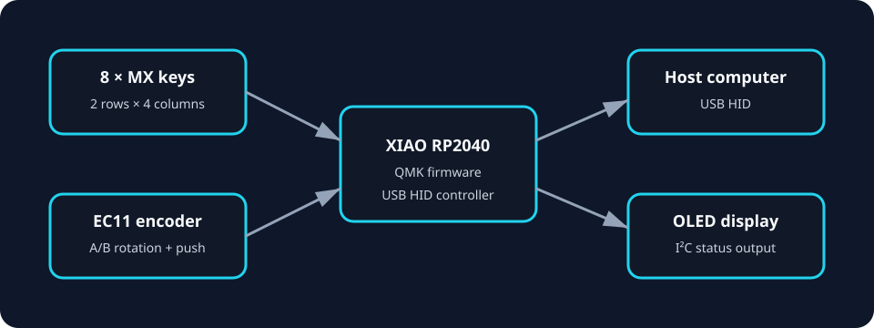

# Macro — Custom RP2040 Macropad

An end-to-end mechatronics build combining PCB design, embedded firmware, human-machine-interface design, and a 3D-printed enclosure. The device uses eight mechanical keys, an EC11 rotary encoder with push switch, an OLED header, and a Seeed Studio XIAO RP2040.

> Status: design package complete; fabrication outputs are included. Hardware behavior must be verified on the physical assembly before the design is treated as production-ready.



## Engineering highlights

- Designed a custom 2 × 5 electrical key matrix in KiCad with one intentionally unpopulated matrix position.
- Added per-switch diodes to prevent ghosting during multi-key input.
- Integrated an RP2040 microcontroller, incremental encoder, encoder push switch, and I²C OLED connector.
- Implemented QMK firmware for key scanning, volume control, mute, and OLED status.
- Packaged Gerber fabrication files and an STL enclosure for reproducible manufacturing.
- Added an automated design audit that cross-checks PCB population against the QMK layout.

## Repository map

| Path | Purpose |
|---|---|
| `PCB/` | Editable KiCad schematic and PCB sources |
| `CAD/case.stl` | Printable enclosure mesh |
| `Production/gerbers.zip` | PCB manufacturing outputs |
| `macro_firmware/` | QMK keyboard definition and keymap |
| `docs/BOM.csv` | Bill of materials |
| `docs/DESIGN.md` | Requirements, architecture, and engineering decisions |
| `docs/BUILD_GUIDE.md` | Fabrication, assembly, flashing, and bring-up |
| `tools/design_audit.py` | PCB/firmware consistency checks |

## Quick validation

```bash
python3 tools/design_audit.py
```

The audit checks the eight Cherry MX footprints, encoder switch, nine diodes, matrix dimensions, and nine populated QMK positions. It does not replace electrical-rule checking, design-rule checking, or physical bring-up.

## Firmware build

1. Install the [QMK CLI](https://docs.qmk.fm/newbs_getting_started).
2. Copy `macro_firmware` into a keyboard folder in a QMK checkout.
3. Compile the default keymap for the RP2040 target.
4. Enter the XIAO RP2040 bootloader and copy the generated UF2 file to the board.

Exact commands depend on the folder name chosen inside the QMK tree. See [the build guide](docs/BUILD_GUIDE.md) before connecting hardware.

## Design correction documented in this version

The PCB contains eight Cherry MX switches plus the encoder push switch: nine physical buttons total. The original firmware layout declared all ten positions of the 2 × 5 matrix and assigned a key to the unpopulated position. This version models only the nine populated positions while retaining the 2 × 5 electrical matrix.

## Skills demonstrated

PCB design · embedded C · QMK · RP2040 · matrix scanning · design for manufacture · CAD-to-print workflow · engineering validation

## Safety and limitations

- Confirm polarity, continuity, and supply rails with a multimeter before inserting the microcontroller.
- Verify the OLED module voltage and pin order; common modules do not all share the same header order.
- Gerbers should be re-generated after any PCB source change.
- The included STL should be checked against the chosen printer, switch plate, fasteners, and tolerances.

## License

Original firmware, documentation, and project-specific design files are released under the MIT License. Third-party footprints, libraries, and tools retain their respective licenses.
